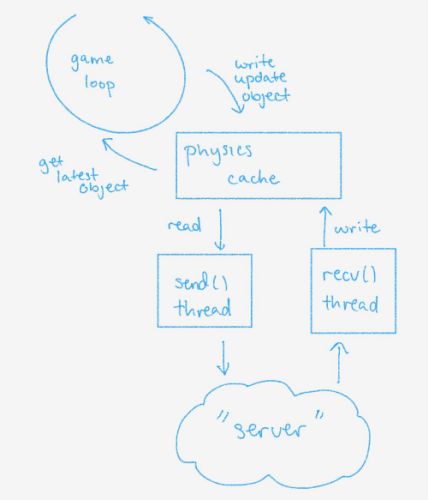

Title: Breakout Island Multiplayer
Author: Ken Ko
Date: 2013-10-26
Tags: coding, android, game, breakout island
Category: tutorials

Had to make some changes regarding the physics*() functions 
now that we're taking multiplayer into account. For an overview,
breakout island will now be architected as such:

We're going for a client-server architecture--but not one as simple
or clean as a dumb terminal to a mainframe. The client, in this case,
will need to be able to "predict" the physics and general outcome 
until the server responds with updated facts. Key being, the server
is Truth. This, of course, requires a buffer to rollback and/or replay
any updates between t_serverupdate and t_now.

To support both adhoc (bluetooth or wifi direct or ...), the client/server
thread architecture depicted above will help to facilitate the ability
to minimize any changes to how we handle physics of the objects in play.
Whereas ranked play (lol) will involve a central server to provide 
the True Word to the clients, an adhoc mode will require the send/recv
threads to now be peer-to-peer. Theorectically, this will be simple.

Famous last words.
